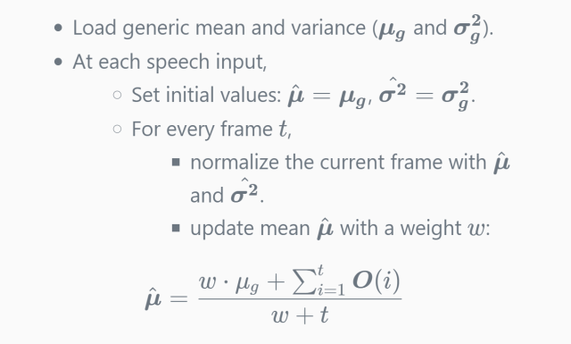

# Normalization / Subtraction

Audio normalization and noise reduction is a vital part for robust speech
recognition in various environment.  Unfortunately Julius has no modern
normalization or noise reduction techniques in it, just offers some basic methods.

Note that *the recognition results may not be the same* between live audio input
and file input, even for equivalent audio data.  It is due to the approximation
of cepstral mean normalization at live audio input as described below.

Here is a brief summary of currently implemented methods.

## DC offset removal

Julius has two different implementation of DC offset removal.

- Input-wise  ([-zmean](https://github.com/julius-speech/julius/blob/master/doc/Options.md#-zmean--nozmean))
- Frame-wise  ([-zmeanframe](https://github.com/julius-speech/julius/blob/master/doc/Options.md#-zmeanframe--nozmeanframe))

[-zmean](https://github.com/julius-speech/julius/blob/master/doc/Options.md#-zmean--nozmean)
enables input-wise offset removal.  For buffered processing
(i.e. file input), the offset is estimated for each input by computing the mean
of the whole input. For stream proccessing (live audio input and network input), the
offset will be determined from the mean of the first 48,000 samples (3 seconds
in 16kHz sampling), and removal will be performed for the rest samples.  This
process is performed prior to all audio processing.

[-zmeanframe](https://github.com/julius-speech/julius/blob/master/doc/Options.md#-zmeanframe--nozmeanframe)
enables frame-wise offset removal.  The offset is estimated per windowed samples
and subtracted within the frame.  This behavior is equivalent to HTK's
`ZMEANSOURCE`, and performed at the first stage of feature extraction.

In most cases `-zmeanframe` is sufficient. This works the same in both buffered
processing and stream processing.

## Spectral subtraction

A simple spectral subtraction can be used to reduce effect of stationary noise.
No dynamic update of the noise spectrum is implemented, i.e., the noise spectrum should be
estimated statically before speech process.  There are two ways.

- Compute the average spectrum of first 300 msec of every input and subtract it
  from the rest input as noise spectrum
  ([-sscalc](https://github.com/julius-speech/julius/blob/master/doc/Options.md#-sscalc)).
  Available for buffered processing only.
- Compute average spectrum from noise-only audio beforehand by the tool
  [mkss](https://github.com/julius-speech/julius/tree/master/mkss), and apply it
  with
  [-ssload](https://github.com/julius-speech/julius/blob/master/doc/Options.md#-ssload-file).
  Available for both buffered and stream input.

Tweaking options of spectral subtractions are
[-sscalclen](https://github.com/julius-speech/julius/blob/master/doc/Options.md#-sscalclen-msec),
[-ssalpha](https://github.com/julius-speech/julius/blob/master/doc/Options.md#-ssalpha-float)
and
[-ssfloor](https://github.com/julius-speech/julius/blob/master/doc/Options.md#-ssfloor-float).

Note that spectral subtraction is performed inside AM instance: those options are
categorized as `AM`. When using multiple acoustic model, the spectral
subtraction should be set up at each module.

## Cepstral mean / variance normalization

Cepstral mean normalization (CMN) and variance normalization (CVN) are standard
techniques to compensate long-term spectral effects caused by different
microphones and audio channels.  CMN subtracts the mean vector from each input
frame.  Additionally, CVN will normalize the variance.  When CMN and CVN are
enabled, features are normalized to $N(0, 1)$.
Note that mean normalization will be performed for static coefficients, whereas
variance normalization will be for all vector dimensions.
Of course, when using CMN/CVN you should have acoustic model trained with CMN/CVN.

 The CMN will be enabled automatically when using acoustic model trained with
 CMN, i.e., the feature parameter of acoustic model has CMN qualifier "`_Z`".

Variance normalization should be enabled manually by option
 [-cvn](https://github.com/julius-speech/julius/blob/master/doc/Options.md#-cvn).  Note that CVN alone is not supported, use CVN with CMN.  At Julius, CMN only or CMN+CVN is allowed.

### CMN / CVN algorithm

At buffered processing like file input, both mean normalization and variance normalization will be performed **per
input**: all samples of an input file are read into memory first, and then their
mean and variance of the whole input are computed.  Then normalization will be
applied using the values.

At stream processing like live audio input, on the other hand, the true mean
and variance are unknown at the time of processing each input frame.  Thus a
modified version of CMN called "**MAP-CMN**" is applied at stream processing. It
starts with a pre-set "**generic mean/variance**", and it updates the current mean
at every frame by smearing the generic value with the mean of recently processed
frames.  The algorithm  is as follows:

<!--
- Load generic mean and variance ($\bm{\mu_g}$ and $\bm{\sigma_g^2}$).
- At each speech input,
  - Set initial values:  $\bm{\hat{\mu}} = \bm{\mu_g}$, $\bm{\hat{\sigma^2}} = \bm{\sigma_g^2}$.
  - For every frame $t$,
    - normalize the current frame with $\bm{\hat{\mu}}$ and $\bm{\hat{\sigma^2}}$.
    - update mean $\bm{\hat{\mu}}$ with a weight $w$:

$$
\bm{\hat{\mu}} = \frac{w \cdot \mu_g +  \sum_{i=1}^t\bm{O}(i)}{w + t}
$$
-->



The weight $w$ can be changed by option
[-cmnmapweight](https://github.com/julius-speech/julius/blob/master/doc/Options.md#-cmnmapweight-float).
Note that only mean is updated at each frame, and variance will be kept within
an input.

### Update / load / save generic mean and variance on stream processing

At stream processing, after each input has been processed and recognition result was
obtained, the generic mean/variance values will be re-computed to fit the
current environment by calculating the mean/variance of the recent five seconds
of the input by default. The re-computed generic mean/variance will be then applied as the
initial values for the next input.  Option
[-cmnnoupdate](https://github.com/julius-speech/julius/blob/master/doc/Options.md#-cmnupdate--cmnnoupdate)
disable this generic mean/variance updates.

The initial generic mean and variance can be loaded from file by option
[-cmnload](https://github.com/julius-speech/julius/blob/master/doc/Options.md#-cmnload-file),
or can be saved to file by option
[-cmnsave](https://github.com/julius-speech/julius/blob/master/doc/Options.md#-cmnsave-file).
The file format is the same as HTK's mean and variance estimation file that can
be generated by `CMEANDIR` and `VARSCALEDIR`, like this:

```text
<CEPSNORM> <>
<MEAN> 13
  (value 1)
  ...
  (value 13)
<VARIANCE> 39
  (value 1)
  ...
  (value 39)
```

When `-cmnload` is set on stream processing, Julius performs MAP-CMN using the given values as the first initial generic mean.
If the file contains variance, it will be applied for CVN.  Please note that for variance normalization the given value will
be streated as static: it will be kept during recognition and not updated while recognition.

When `-cmnload` is not set, Julius start with zero mean and variance, so the
first utterance will not be recognized correctly.  When `-cmnsave` is specified,
the generic mean and variance, being computed from the last 5 seconds, will be
saved to file at every input ends.

If you do not want to update the general mean while recognition and keep the starting values from `-cmnload` for the initial values at each stream input, set [-cmnnoupdate](https://github.com/julius-speech/julius/blob/master/doc/Options.md#-cmnupdate--cmnnoupdate).

### Static mean / variance

You may want to use a static mean and variance unchanged for
all frames. The static CMN can be performed by setting option
[-cmnstatic](https://github.com/julius-speech/julius/blob/master/doc/Options.md#-cmnstatic) together with [-cmnload](https://github.com/julius-speech/julius/blob/master/doc/Options.md#-cmnload-file).  In that case, at both stream processing and buffered processing, the given mean and variance will be applied for all input frames.  Another option [-cvnstatic](https://github.com/julius-speech/julius/blob/master/doc/Options.md#-cvnstatic) can be used to apply static normalization for variance only but leave mean as normal behavior (MEAN ignored in the loaded file).

### Summary

Here is the summary of CMN / CVN algorithm being applied when the options are specified.  Note that parameter qualifier "`_Z`" in the given acoustic model is required in all situation to enable CMN and/or CVN.

Without `-cvn`:

|Options|Buffered Input|Stream Input|
|:--|:--|:--|
|-|self mean CMN | MAP-CMN, no init, update|
|-cmnload |static mean CMN|MAP-CMN, loaded init, update |
|-cmnload, -cmnnoupdate |static mean CMN|MAP-CMN, loaded init, keep init|
|-cmnload, -cmnstatic |static mean CMN|static mean CMN |

With `-cvn`:

|Options|Buffered Input|Stream Input|
|:--|:--|:--|
|-|self mean CMN / self var CVN| MAP-CMN, no init, update / CVN, no init, last 5 sec.|
|-cmnload |static mean CMN / static var CVN|MAP-CMN, loaded init, update / static var CVN|
|-cmnload, -cmnnoupdate |static mean CMN / static var CVN |MAP-CMN, loaded init, keep init / static var CVN|
|-cmnload, -cmnstatic |static mean CMN / static var CVN|static mean CMN / static var CVN |
|-cmnload, -cvnstatic |self mean CMN / static var CVN|MAP-CMN, loaded init, update / static var CVN |

## Frequency warping

Option
[-vtln](https://github.com/julius-speech/julius/blob/master/doc/Options.md#-vtln-alpha-lowcut-hicut)
enables a frequency warping function, so called vocal tract length normalization
(VTLN). This can be applied as a simple speaker normalization that compensates
speaker's vocal tract size.

It is a simple linear function, controlled by a warping factor $\alpha$ and
warping frequency boundaries.  The algorithm and parameter values are the same
as HTK's VTLN feature. HTK's configuration variables `WARPFREQ`, `WARPHCUTOFF`
and `WARPLCUTOFF` can be applied as is.

Unfortunately Julius has no searching scheme to find a working warping factor
for given input.
