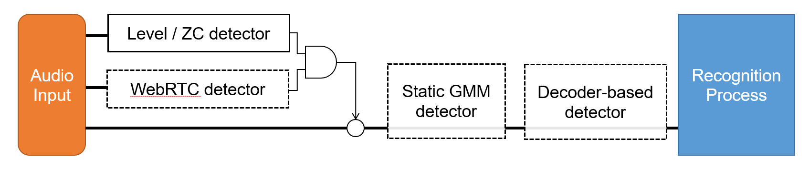
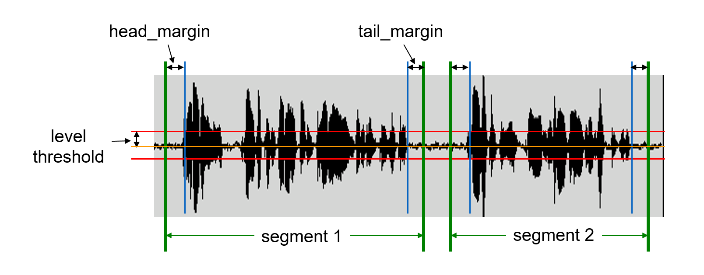

# Voice Activity Detection

Voice activity detection (VAD) is a process of identifying speech part in audio
stream.  For speech recognizer, both "detecting speech part" and "rejecting
noise part" are essential.  Accuracy and low-latency VAD is critical and a key
technique for practical ASR applications.

Julius has multiple VAD detection modules. When multiple VAD detectors are
 enabled, only the speech frames that **qualifies all the detectors** will be
 processed.

- Level and zero cross threshold detector
- WebRTC detector
- Static GMM detector
- Decoder-based detector

Note that level / zero cross detector and WebRTC detector are parallel but
others are cascaded: both level / zero cross detector and WebRTC detector read
the full audio input stream and output detection result for every frame, whereas
the static GMM detector and decoder-based detector runs after those, only
processing the audio samples that have been passed by the former two detectors.
The block diagram of detection modules are as follows:

All VAD detector is disabled by default for buffered processing.  For stream
processing, the level and zero cross threshold detector is enabled by default.
Other detectors should be set up and enabled by options.

## Level and zero cross threshold detector

A basic VAD module based on signal level and zero-cross threshold.  Audio signal
in which both the signal level and number of zero-cross is higher than the given
threshold will be treated as speech segment.

 It's trivial, simple, light-weight method, but still works fine on high SNR
 condition.

Parameters can be specified by
[-lv](https://github.com/julius-speech/julius/blob/master/doc/Options.md#-lv-threshold),
[-zc](https://github.com/julius-speech/julius/blob/master/doc/Options.md#-zc-thresold),
[-headmargin](https://github.com/julius-speech/julius/blob/master/doc/Options.md#-headmargin-msec)
and
[-tailmargin](https://github.com/julius-speech/julius/blob/master/doc/Options.md#-tailmargin-msec)
options.  The
[-headmargin](https://github.com/julius-speech/julius/blob/master/doc/Options.md#-headmargin-msec)
and
[-tailmargin](https://github.com/julius-speech/julius/blob/master/doc/Options.md#-tailmargin-msec)
options specifies the margin before / after the detected segment, as illustrated
below: 

This detector is enabled by default for stream processing (live audio and
network input), and disabled for buffered processing (file input).  Set
[-cutsilence](https://github.com/julius-speech/julius/blob/master/doc/Options.md#-cutsilence--nocutsilence)
to force enable this detector, and
[-nocutsilence](https://github.com/julius-speech/julius/blob/master/doc/Options.md#-cutsilence--nocutsilence)
to disable.

## WebRTC detector

WebRTC VAD is a GMM based voice activity detection developed by WebRTC group for
real-time speech processing.  The WebRTC implementation is widely accepted as
one of the modern fast VAD, and is an open-source gold standard.  The original
source code is open at [WebRTC site](https://webrtc.org/native-code/) as part of
wider range of codes, and you can find the exact code
[here](https://webrtc.googlesource.com/src/+/master/common_audio/vad/). Julius
integrates its forked version "[libfvad: voice activity detection (VAD)
library](https://github.com/dpirch/libfvad)".

This detector is disabled by default.  Set mode from 0 to 3 with
[-fvad](https://github.com/julius-speech/julius/blob/master/doc/Options.md#-fvad-mode)
option to enable.  You can also tease parameters with
[-fvad_param](https://github.com/julius-speech/julius/blob/master/doc/Options.md#-fvad_param-nframe-threshold).

Note that, for internal reason, *this WebRTC detector will not work when the
level and zero cross threshold detector is totally disabled* (for file input, or
forced to be disabled by `-nocutsilence`),   If you want to switch off the level
and zero cross threshold detector and run WebRTC detector only, leave it enabled
(set `-cutsilence` for file input) and set a minimum value to the threshold,
i.e. "`-lv 1`" to enforce the threshold detector to always pass through the
input.

## Static GMM based detector

Gaussian mixture model (GMM) based speech detector.  Requires the voice / noise
GMM model trained beforehand.  Unlike WebRTC detector, no adaptation will be
performed while running.

This detector is disabled by default.  To enable, build Julius with configure
option `--enable-gmm-vad`.  Note that for internal reason, this static detector
and "GMM input rejection" feature is *exclusive*: when this detector is enabled,
GMM input rejection will not be available.

The definition of GMM should be in HTK format HMM acoustic model file, contains
voice models and noise models.  Each model should have 3 states (1 emitting
state), which has pdf as diagonal gaussian mixtures.  Several models can be
defined.

At runtime, specify the GMM definition file with option
[-gmm](https://github.com/julius-speech/julius/blob/master/doc/Options.md#-gmm-hmmdefs_file),
and list of noise HMM names to be rejected by
[-gmmreject](https://github.com/julius-speech/julius/blob/master/doc/Options.md#-gmmreject-string).
You can tease detection margin and up/down trigger sensitivity by
[-gmmmargin](https://github.com/julius-speech/julius/blob/master/doc/Options.md#-gmmmargin-frames),
[-gmmup](https://github.com/julius-speech/julius/blob/master/doc/Options.md#-gmmup-value)
and
[-gmmdown](https://github.com/julius-speech/julius/blob/master/doc/Options.md#-gmmdown-value)
options.

If acoustic feature of the GMM is different from the main acoustic model for
recognition, you should specify the GMM's feature extraction parameters using
[-AM_GMM](https://github.com/julius-speech/julius/blob/master/doc/Options.md#-am_gmm)
section.

## Decoder-based detector

Decoder-based VAD is an experimental function, utilizing the statistics of main
speech decoding process for speech detection.  The first pass of recognition
process will be performed for the entire input on real-time for given input
stream, and the hypothesis statistics of "silence words" at the ongoing
recognition process are inspected to judge whether speech segment starts or ends
at the certain frame. The silence words are the words that is assigned a
sequence of silence models in word dictionary.  On many speech recognition the
silence words should be a beginning of sentence marker, end of sentence marker,
or punctuation words.

This detector is disabled by default.  To test it, set configure option
`--enable-decoder-vad` at build time and set option
[-spsegment](https://github.com/julius-speech/julius/blob/master/doc/Options.md#-spsegment)
at run time.  To determine the silence words, the name of silence models should
be passed to
[-pausemodels](https://github.com/julius-speech/julius/blob/master/doc/Options.md#-pausemodels-string)
options.
